## Part 1 ipcalc tool

#### 1.1 Networks and masks
#####
   
     1) ip : 192.167.38.54/13
     network address : 192.160.0.0/13

     2) conversion of the mask 255.255.255.0
     to prefix 255.255.255.0/24
     to binary 11111111.11111111.11111111.00000000
     conversion of the /15
     to normal 255.254.0.0
     to binary 11111111.11111110.00000000.00000000
     conversion of the 11111111.11111111.11111111.11110000
     to normal 255.255.255.240
     to prefix 255.255.255.240/28

     3) min and max host 12.167.38.4 network with masks: 
     /8    min: 12.0.0.1       max: 12.255.255.254
     /16   min: 12.167.0.1     max: 12.167.255.254
     /23   min: 12.167.38.1    max: 12.167.39.254
     /4    min: 0.0.0.1        max: 12.255.255.254
#####

#### 1.2 localhost
#####
   
    194.34.23.100 - no
    127.0.0.2 - yes
    127.1.0.1 - yes
    128.0.0.1 - no 

#####
#### 1.3 Network ranges and segments
#####

    1) ranges:
    10.0.0.45 - private
    134.43.0.2 - public
    192.168.4.2 - private
    172.20.250.4 - private 
    172.0.2.1 - public
    192.172.0.1 - private
    172.68.0.2 - public
    172.16.255.255 - private
    10.10.10.10 - private
    192.169.168.1 - public

    2) possible gateway for 10.10.0.0/18 network:
    10.0.0.1 - no
    10.10.0.2 - yes 
    10.10.10.10 - yes
    10.10.100.1 - no
    10.10.1.255 - yes

#####

- example of work ipcalc:

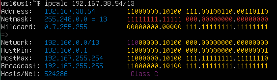

- how to define net ip:

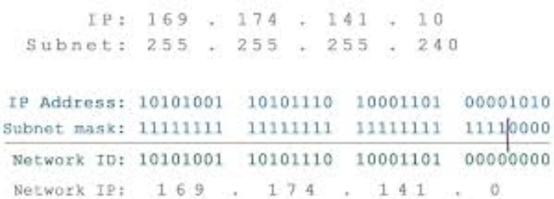

- how to define min and max hosts:

#####

    `MAX` host = 2^n - 2 
    where n = host bits

    `MIN` host = the first available IP + 1 

#####

#### IP Classification
#####

    There are classifications of IP addresses as "private" and "public". The following ranges of addresses are reserved for private (aka LAN) networks:
    - *10.0.0.0* — *10.255.255.255* (*10.0.0.0/8*);
    - *172.16.0.0* — *172.31.255.255* (*172.16.0.0/12*);
    - *192.168.0.0* — *192.168.255.255* (*192.168.0.0/16*);
    - *127.0.0.0* — *127.255.255.255* (Reserved for loopback interfaces (not used for communication between network nodes), so called localhost).

#####
## Part 2 Static routing between two machines

- output of `ip a` for ws1:

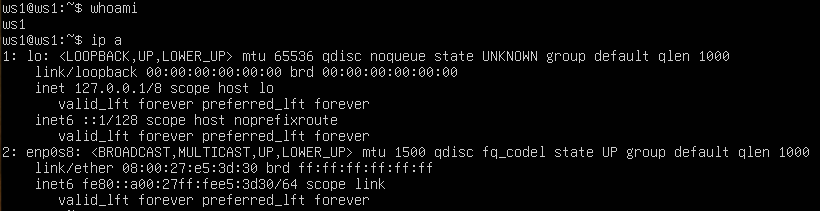

- output of `ip a` for ws2:

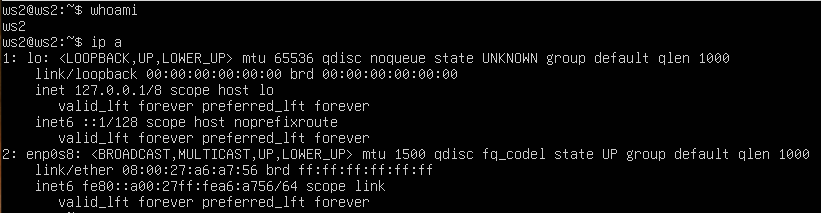

where:

#####

    enp0s3 — name of net interface ;
    link/ether - MAC;
    inet — IP

#####

- updated and applied netplan config for ws1:

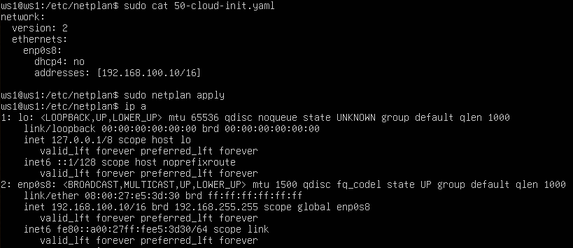

- updated and applied netplan config for ws2

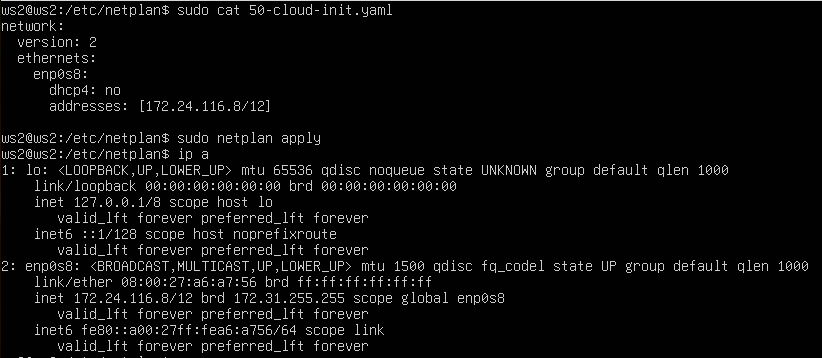

#### 2.1 Adding a static route manually

- add route from ws1 to ws2:

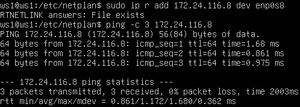

- add route from ws2 to ws1:

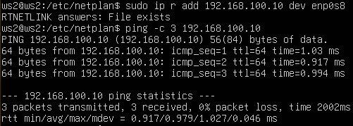

#### 2.2 Adding a statis route with saving 

- updated netplan config for ws1:

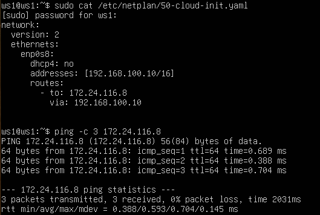

- updated netplan config for ws2:

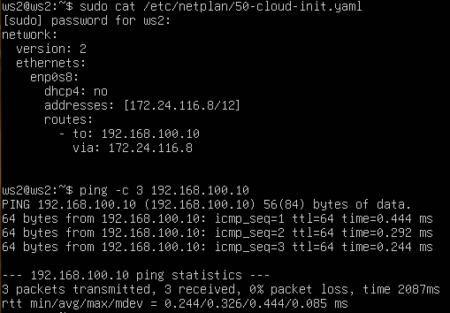

## Part 3 iperf3 utility

#### 3.1 Connectionn speed
#####

    connection speed:
    8 Mpbs = 1 MB/s
    100 MB/s = 800 000 Kbps 
    1 Gbps = 1 000 Mbps

#####

#### 3.2 iperf3 utility 
- measurement of speed connection between ws1 ans ws2

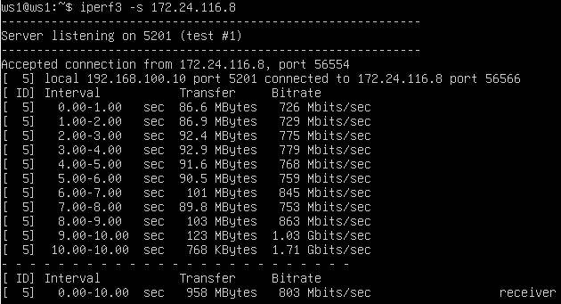
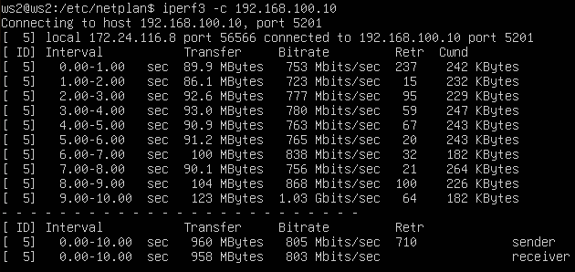

## Part 4 Network firewall

#### 4.1 iptables utility 

- example of path of packeats for iptables:

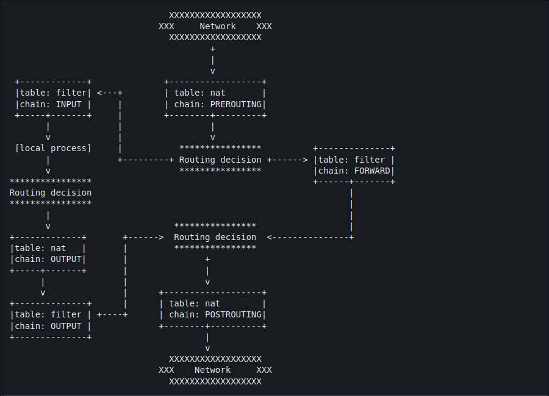

- firewall conf for ws1

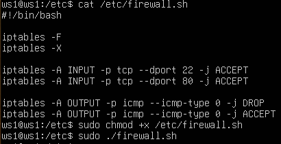

- firewall conf for ws2

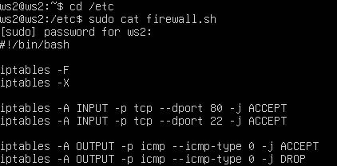

#####

    firewall of ws1 will block any attempt of ping ws1, rules work from top to bottom
    and DROP will work firstly, on ws2 ping will be work beacuse ACCEPT rule goes first

#####

#### 4.2 nmap utility

- output of call `ping` and `nmap`

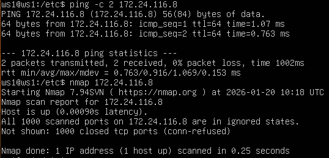
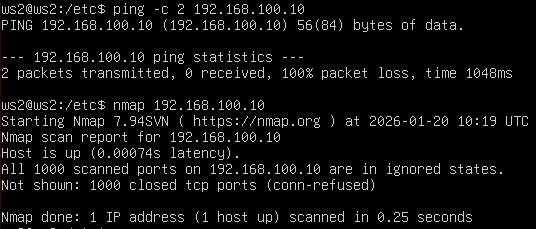

## Part 5 static network routing

#### 5.1 Configuration of machine addresses

- ws11 conf 

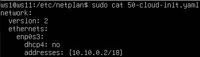

- r1 conf

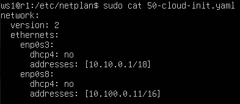

- ws21 conf

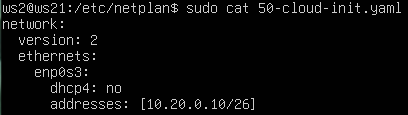

- ws22 conf

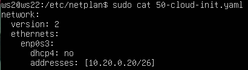

- r2 conf 

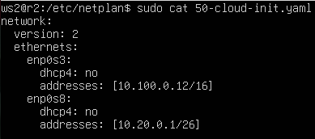

- call of `netplan apply` and `ip -4 a` 

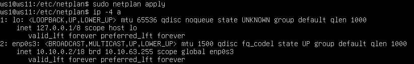

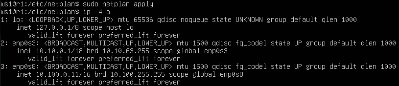

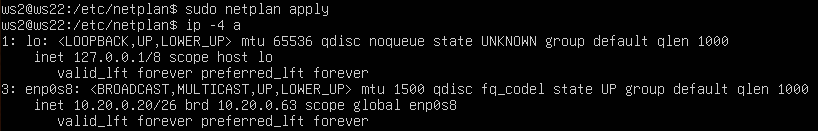

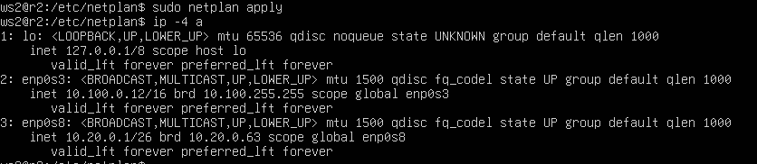

- ping r1 from ws11:

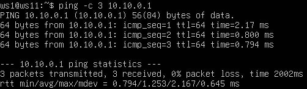

- ping ws22 from ws21:

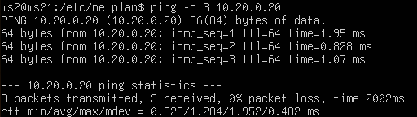

#### 5.2 Enabling ip forwarding 

- call of `sysctl -w inet.ipv4.ip_forward=1` for r1:

- call of `sysctl -w inet.ipv4.ip_forward=1` for r2:

- example of `sysctl.conf`:

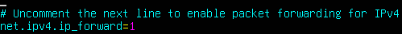

- update of r1 conf:

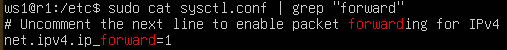

- update of r2 conf:

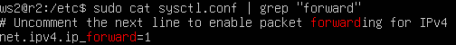

#### 5.3 Default route configuration:

- netplan conf for ws1:

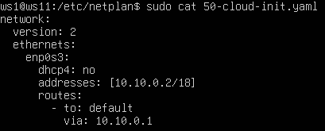

- netplan conf for ws21:

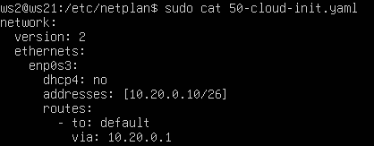

- netplan conf for ws22:

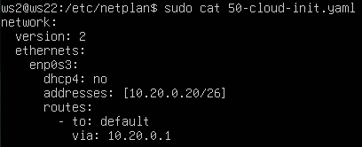

- call of `ip r` for ws11:

- call of `ip r` for ws21:

- call of `ip r` for ws22:

- ping r2 from ws11:

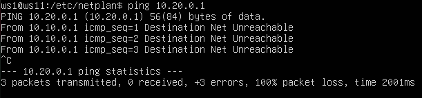

#### 5.4 Adding static routes

- add static route to r1

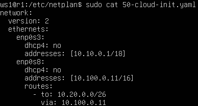

- add static route to r2

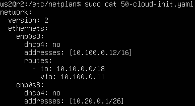

- call of `ip r` for r1:

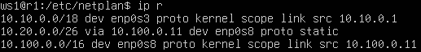

- call of `ip r` for r2:

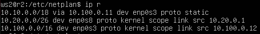

- tables of ws11 routes:

#####

    A route other than 0.0.0.0/0 was chosen for the address 10.10.0.0/18 because it is a network address and is reachable without a gateway.

#####

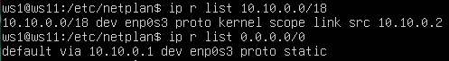

- succesfull ping r2 from ws11 after adding default routes (rem 5.3)

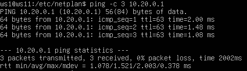

#### 5.5 Making a router list

- run of tcpdump on r1:

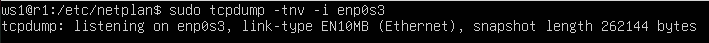

- run of traceroute on ws11:

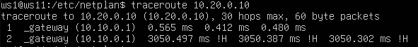

- dump of traffic of path from ws11 to ws21 on r1:

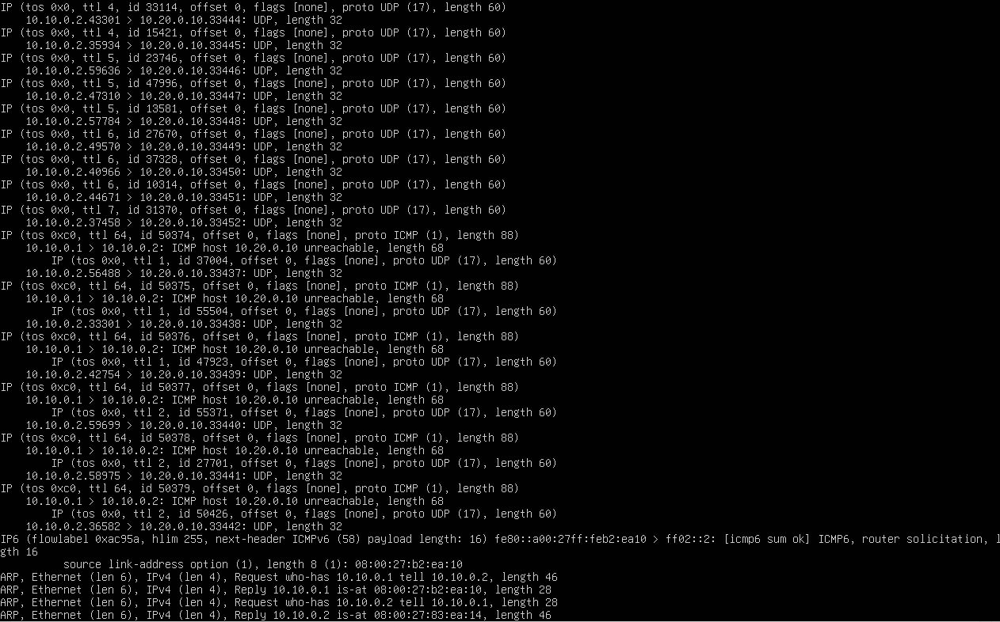

- number of transfered packets:

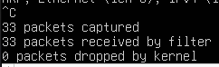

#####

    1. The utility uses a specific protocol to send a sequence of IP packets (UPD or ICPM).

    2. By default, the number of packets is limited to 3.

    3. Each subsequent packet is sent with a TTL increment of 1. Thus, the first packet has a TTL of 1, the second has a TTL of 2, and so on.

    4. When transmitted from one router to another, the TTL of each packet is decreased by 1 to prevent the packet from hopping between routers indefinitely.

    5. When a packet's TTL reaches zero, the router discards the packet and sends back an error message.

#####

#### 5.6 Using ICMP protocol

- ping non-existent IP:

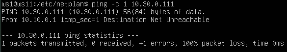

- run tcpdump and dump of traffic:

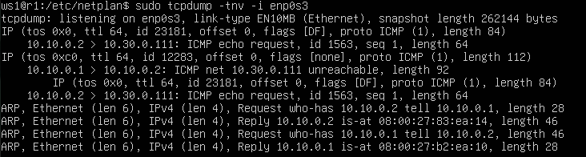

## Part 6 Dynamic IP configuration using DHCP

- updated config file of dhcpd.conf r2:

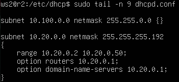

- updated config of resolv.conf r2:

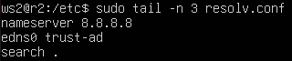

- restart of dhcp daemon r2:
 
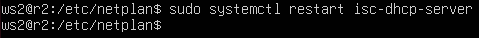

- new dynamic ip for ws21:

- adding mac address for ws11:

- updated config file of dhcpd.conf for r1:

- updated resolv.conf for r1:

- restart of dhcp daemon for r1:

- error for a new IP on ws11:

- ip for ws21 before requesting new ip:

- the process of requsting new ip for ws21:

- new ip for ws21 after request:

- `dhclient -r enp0s3` used for freeing an IP address
- `dhclient -v enp0s3` used for request new IP address

## Part 7 NAT

- updated `/etc/apache2/ports.conf` for ws22:

- updated `/etc/apache2/ports.conf` for r1:

- start of apache2 service for ws22:

- start of apache2 service for r1:

- updated rules for firewall on r2:

- attempt of ping ws22 from r1:

- adding new rule for firewall on r2:

- succesful attemp of ping ws22:

- adding rules for SNAT and DNAT for firewall on r2:

- check the TCP connection for SNAT between ws22 and apache server on r1:

- check the TCP connection for DNAT between between r1 and apache server on ws22:

